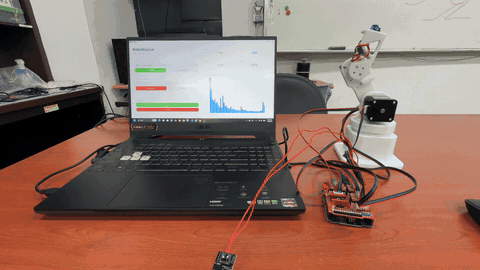

# RobotDance 🤖🎵

讓機械手臂跟著音樂跳舞！<br>
Make a robot arm dance to music!



🔊 [點這裡看有聲音的影片 / Watch the video with sound](media/demo.mp4)

---

## 這是什麼？ What is this?

放一首歌（電腦裡的音樂檔或 YouTube 連結），電腦會「聽」音樂的節奏和低音，然後告訴 Arduino 怎麼動，三顆馬達就會跟著音樂擺動。<br>
Play a song (a music file or a YouTube link). The computer "listens" to the beat and bass, then tells the Arduino how to move, and the three motors dance along.

整個專案分成兩個部分：<br>
The project has two parts:

| 檔案 File | 做什麼 What it does |
|---|---|
| `dancearm/dancearm.ino` | Arduino 的程式，負責轉動馬達<br>Arduino code that turns the motors |
| `robot_dance_controller.py` | 電腦上的程式，負責放音樂、分析節奏<br>Computer app that plays music and finds the beat |

手臂怎麼動：<br>
How the arm moves:

- **X 軸（底座）**：跟著人聲、高音左右轉<br>
  **X (base)**: turns left and right with vocals and high notes
- **Y 軸（大臂）**：跟著節拍上下擺<br>
  **Y (arm)**: moves up and down with the beat
- **Z 軸（小臂）**：低音越重伸越出去，打拍子時收回來<br>
  **Z (forearm)**: reaches out with heavy bass, pulls back on each beat

---

## 需要準備 What you need

**硬體 Hardware**
- Arduino Uno ×1
- CNC Shield（馬達擴充板）+ 步進馬達驅動板（A4988 或 DRV8825）×3<br>
  CNC Shield + stepper drivers (A4988 or DRV8825) ×3
- 步進馬達 ×3<br>
  Stepper motors ×3
- 12V 電源供應器（給馬達用）<br>
  12V power supply (for the motors)
- USB 線（要能傳資料的，不是只能充電的那種）<br>
  USB cable (must support data, not charge-only)

**軟體 Software**（下面會教怎麼裝 / installation steps below）
- Arduino IDE（或 VS Code + PlatformIO / or VS Code + PlatformIO）
- Python

---

## 步驟 1：接線 Step 1: Wiring

把 CNC Shield 插在 Arduino 上，三個驅動板插在 X、Y、Z 的位置，馬達接到對應的插座。<br>
Plug the CNC Shield onto the Arduino, put the three drivers in the X, Y, Z slots, and connect each motor to its socket.

| 馬達 Motor | STEP 腳位 | DIR 腳位 |
|---|---|---|
| X（底座 base） | D2 | D5 |
| Y（大臂 arm） | D3 | D6 |
| Z（小臂 forearm） | D4 | D7 |

ENABLE 接 D8。用 CNC Shield 的話這些都已經接好了，不用另外接線。<br>
ENABLE is on D8. If you use a CNC Shield, these are already connected for you.

> 💡 驅動板要設成 **1/16 微步**（驅動板底下的三個跳線帽全部插上）。<br>
> Set the drivers to **1/16 microstepping** (put all three jumpers under each driver).

---

## 步驟 2：把程式燒進 Arduino Step 2: Upload the code to Arduino

### 先下載專案 First, download the project

1. 點這個網頁上方綠色的 **Code** 按鈕 → **Download ZIP**。<br>
   Click the green **Code** button at the top of this page → **Download ZIP**.
2. 在下載的 `dancearm-main.zip` 上**按右鍵 → 全部解壓縮**。<br>
   **Right-click** `dancearm-main.zip` → **Extract All**.
   > ⚠️ 一定要先解壓縮！直接在 ZIP 裡面點開檔案會打不開或無法上傳。<br>
   > ⚠️ You must extract it first! Opening files directly inside the ZIP won't work.
3. 解壓縮後打開資料夾，確認裡面**直接看得到** `README.md`、`dancearm` 資料夾這些檔案。如果只看到另一個 `dancearm-main` 資料夾，就再點進去一層。<br>
   Open the extracted folder and make sure you can **directly see** `README.md` and the `dancearm` folder. If you only see another `dancearm-main` folder, go one level deeper.

接下來選一種方法上傳（**推薦方法 A，比較簡單**）。<br>
Then pick one way to upload (**Method A is easier**).

### 方法 A：Arduino IDE Method A: Arduino IDE

1. 下載安裝 [Arduino IDE](https://www.arduino.cc/en/software)。<br>
   Download and install [Arduino IDE](https://www.arduino.cc/en/software).
2. 打開專案裡的 `dancearm` 資料夾，雙擊 `dancearm.ino`，Arduino IDE 會自動開啟它。<br>
   Open the `dancearm` folder in the project and double-click `dancearm.ino`. It opens in Arduino IDE.
3. 用 USB 線把 Arduino 接上電腦。<br>
   Connect the Arduino to your computer with the USB cable.
4. 在上方的下拉選單選 **Arduino Uno** 和它的 COM 埠。<br>
   In the dropdown at the top, select **Arduino Uno** and its COM port.
5. 按左上角的 **→（上傳）** 按鈕。下面出現「上傳完成」就成功了！<br>
   Click the **→ (Upload)** button at the top left. When it says "Done uploading", you're done!

### 方法 B：VS Code + PlatformIO Method B: VS Code + PlatformIO

1. 下載安裝 [VS Code](https://code.visualstudio.com/)。<br>
   Download and install [VS Code](https://code.visualstudio.com/).
2. 打開 VS Code，點左邊的「擴充功能」圖示（四個方塊），搜尋 **PlatformIO IDE** 並安裝。裝完會要求重開 VS Code。<br>
   Open VS Code, click the Extensions icon on the left (four squares), search **PlatformIO IDE** and install it. Restart VS Code when asked.
3. 在 VS Code 選「檔案 → 開啟資料夾」，選**裡面直接有 `platformio.ini` 的那個資料夾**。<br>
   In VS Code, choose File → Open Folder and pick **the folder that directly contains `platformio.ini`**.
4. 用 USB 線把 Arduino 接上電腦。<br>
   Connect the Arduino to your computer with the USB cable.
5. 點 VS Code 最下面藍色狀態列上的 **→（箭頭）** 按鈕上傳。看到 `SUCCESS` 就成功了！<br>
   Click the **→ (arrow)** button on the blue bar at the bottom of VS Code. When you see `SUCCESS`, you're done!

---

## 步驟 3：安裝 Python Step 3: Install Python

1. 到 [python.org](https://www.python.org/downloads/) 下載並安裝 Python。<br>
   Download and install Python from [python.org](https://www.python.org/downloads/).
   > ⚠️ 安裝時一定要勾選 **Add python.exe to PATH**！<br>
   > ⚠️ Make sure to check **Add python.exe to PATH** during installation!
2. 打開專案資料夾（有 `requirements.txt` 的那層），在空白處**按右鍵 → 在終端機中開啟**，會跳出一個可以打指令的視窗。<br>
   Open the project folder (the one with `requirements.txt`), **right-click** an empty spot → **Open in Terminal**. A window where you can type commands will open.
   > 用 VS Code 的話也可以選「終端機 → 新增終端機」。<br>
   > In VS Code, you can also use Terminal → New Terminal.
3. 把下面這行貼進去按 Enter，它會自動安裝需要的套件（要等幾分鐘）：<br>
   Paste this line and press Enter. It installs everything needed (takes a few minutes):
   ```bash
   pip install -r requirements.txt
   ```
4. （想用 YouTube 才需要）再貼這行安裝 FFmpeg，裝完**關掉終端機再重新打開**：<br>
   (Only for YouTube) Paste this line to install FFmpeg, then **close and reopen the terminal**:
   ```bash
   winget install ffmpeg
   ```

---

## 步驟 4：開始跳舞！ Step 4: Let's dance!

1. **開機前先把手臂擺到起始姿勢**，Arduino 會把接上電的位置當作起點。<br>
   **Put the arm in its starting pose before powering on.** The Arduino treats this position as the starting point.
2. 插上 12V 電源和 USB 線。<br>
   Plug in the 12V power and the USB cable.
3. 在終端機輸入下面這行，會跳出操作視窗：<br>
   Type this in the terminal and the app window will open:
   ```bash
   python robot_dance_controller.py
   ```
4. **ARDUINO CONNECTION**：在下拉選單選 Arduino 的 COM 埠（例如 `COM3`），按 **Connect**，出現綠色的 `Connected` 就代表連上了。<br>
   **ARDUINO CONNECTION**: pick the Arduino's COM port (e.g. `COM3`) and click **Connect**. A green `Connected` means it worked.
5. **AUDIO SOURCE**：選一首歌：<br>
   **AUDIO SOURCE**: pick a song:
   - 貼上 YouTube 網址，按 **Fetch YouTube**<br>
     Paste a YouTube link and click **Fetch YouTube**
   - 或按 **Local File** 選電腦裡的音樂檔（mp3、wav 等）<br>
     Or click **Local File** to choose a music file (mp3, wav, etc.)
6. 右邊出現 BPM 數字後，按 **▶ Play**，手臂就會開始跳舞了 🎉<br>
   When the BPM number appears on the right, click **▶ Play** and the arm starts dancing 🎉
7. 按 **■ Stop** 停止。<br>
   Click **■ Stop** to stop.

---

## 遇到問題？ Having trouble?

| 問題 Problem | 解決方法 Solution |
|---|---|
| 選單裡找不到 COM 埠<br>No COM port in the list | 換一條 USB 線（有些線只能充電）；按 **Refresh** 重新整理。便宜的 Arduino 可能要安裝 CH340 驅動程式。<br>Try another USB cable (some are charge-only); click **Refresh**. Cheap Arduino clones may need the CH340 driver. |
| 按 Connect 失敗<br>Connect fails | 關掉其他正在用 Arduino 的程式（例如 Arduino IDE、序列埠監控視窗），再試一次。<br>Close other programs using the Arduino (Arduino IDE, serial monitor), then try again. |
| 專案打不開、上傳按鈕沒出現<br>Project won't open / no upload button | 確認 ZIP 有**先解壓縮**；Arduino IDE 要打開 `dancearm/dancearm.ino`；VS Code 要打開**直接有 `platformio.ini`** 的資料夾。<br>Make sure you **extracted** the ZIP; in Arduino IDE open `dancearm/dancearm.ino`; in VS Code open the folder that **directly contains `platformio.ini`**. |
| 馬達不動或只會抖<br>Motors don't move or only buzz | 檢查 12V 電源有沒有接上、驅動板有沒有插反、馬達線有沒有接好。<br>Check the 12V power, that drivers aren't plugged in backwards, and the motor wires. |
| 打 `pip` 或 `python` 說找不到指令<br>`pip` or `python` not found | 重裝 Python，記得勾 **Add python.exe to PATH**，然後重新打開終端機。<br>Reinstall Python with **Add python.exe to PATH** checked, then reopen the terminal. |
| YouTube 下載失敗<br>YouTube download fails | 確認有裝 FFmpeg，並執行 `pip install -U yt-dlp` 更新下載工具。<br>Make sure FFmpeg is installed and run `pip install -U yt-dlp` to update the downloader. |

---

## 進階：想改動作？ Advanced: Want to change the moves?

- **動作幅度 Movement range**：改 `robot_dance_controller.py` 最上面的 `X_MIN`、`X_MAX` 等數字。<br>
  Edit `X_MIN`, `X_MAX`, etc. at the top of `robot_dance_controller.py`.
- **動作滑順度 Smoothness**：改 `LERP_ALPHA`，越小越滑順、越大反應越快。<br>
  Edit `LERP_ALPHA`: smaller is smoother, bigger reacts faster.
- **馬達速度 Motor speed**：改 `dancearm/dancearm.ino` 裡的 `STEP_DELAY`，越小越快，但太小馬達會卡住。改完要重新上傳到 Arduino。<br>
  Edit `STEP_DELAY` in `dancearm/dancearm.ino`: smaller is faster, but too small makes the motors skip. Re-upload to the Arduino after changing it.

電腦傳給 Arduino 的格式是 `<X,Y,Z>`（單位是馬達步數），鮑率 115200。<br>
The computer sends `<X,Y,Z>` (in motor steps) to the Arduino at 115200 baud.
